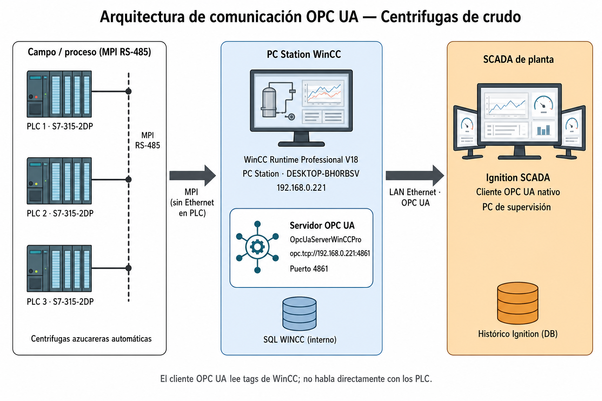
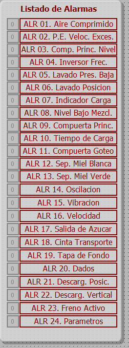

# Informe técnico — Comunicación OPC UA con servidor WinCC Runtime Professional

**Entregable para el usuario final / desarrollo SCADA Ignition**  
**Elaborado por:** IndustrialLAB — Ing. en Computación  
**Alcance:** centrífugas azucareras automáticas de crudo — red MPI RS-485 con tres PLC Siemens S7-315-2DP  
**Estado:** trabajo de comunicación **cerrado y validado en planta**  
**Fecha de cierre de commissioning:** 27 de agosto de 2026  
**Fecha de este documento:** 31 de agosto de 2026  

| Documento | Uso |
|---|---|
| Este informe (Markdown) | Fuente del entregable operativo |
| Word **Rev.1** (`entregable/`) | Versión **entregada al cliente** (revisión manual) |
| `variables/tabla-variables-centrifuga-1.md` | Catálogo de tags prioritarios (centrífuga 1 / `HMI_Connection_1`) |
| `imagenes/alarmas-en-orden.png` | Listado de alarmas del HMI (ALR 01–24), vinculado a `nF01`–`nF24` |
| `variables/listado-completo-variables.md` | Listado completo de tags del Runtime (PC Station) |
| Manual operativo WinCC RT (Indicadores de Producción) | Detalle de pantallas y operación del HMI existente — ya enviado a Producción e Instrumentos |

---

## 1. Introducción

Quedó implementada y validada la exposición de variables de proceso desde **WinCC Runtime Professional V18** (PC Station de planta) hacia un cliente **OPC UA**, con destino el desarrollo del SCADA en **Ignition** sobre la PC de supervisión.

Los PLC **S7-315-2DP** se comunican con WinCC por **MPI (RS-485)**; no disponen de Ethernet de proceso hacia el SCADA. El cliente OPC **no habla con el PLC**: lee tags del Runtime WinCC, que a su vez mantiene la comunicación MPI.

A partir de este punto, el desarrollo de pantallas, historiales y lógica de Ignition puede realizarse sobre los datos servidos por el endpoint documentado en la sección 4.

---

## 2. Arquitectura de la comunicación



| Elemento | Descripción |
|---|---|
| Campo / proceso | Centrífugas azucareras automáticas de crudo |
| Controladores | Tres PLC Siemens **S7-315-2DP** en red **MPI RS-485** |
| Capa HMI / Runtime | WinCC Runtime Professional V18 (PC Station, proyecto **Runtime Station_2**) |
| Servidor de datos hacia SCADA | **OPC UA** nativo de WinCC RT Professional |
| Cliente SCADA | **Ignition** (conexión directa al endpoint UA; no requiere intermediarios en producción) |

**Estación WinCC de planta:**

| Parámetro | Valor |
|---|---|
| Hostname | `DESKTOP-BH0RBSV` |
| Usuario Windows | `desktop-bh0rbsv\siemens` |
| Dirección IP | `192.168.0.221` |
| Puerto OPC UA | **4861** |
| Servicio Windows | `OpcUaServerWinCCPro` (inicio Automatic) |
| Endpoint | `opc.tcp://192.168.0.221:4861` |

---

## 3. Variables de proceso

Hay dos familias de tags, con distinto origen y uso:

| Familia | Origen | Uso |
|---|---|---|
| **Vinculadas al PLC** | Lectura directa por las conexiones HMI (`HMI_Connection_n`) | Prioritarias: estado de máquina, tiempos de ciclo, RPM y carga desde el S7 |
| **Internas del SCADA WinCC** | Cálculos intermedios en Runtime (scripts / indicadores de producción) | KPIs y tiempos de la hora en curso; no sustituyen la lectura de PLC |

Las variables de PLC van primero: son la vinculación directa con cada centrífuga. Las internas se documentan después; interpretan o agregan esos datos y **no deben tomarse como valor crudo de campo**.

### 3.1 Convención de nombres — `HMI_Connection_n`

Cada PLC / centrífuga se lee por una conexión HMI distinta. El **primer dígito** del nombre de tag coincide con el número de conexión y de máquina:

| Centrífuga | Conexión WinCC | Prefijo de tag |
|---|---|---|
| 1 | `HMI_Connection_1` | `1…` |
| 2 | `HMI_Connection_2` | `2…` |
| 3 | `HMI_Connection_3` | `3…` |

Los nombres de las tablas siguientes se muestran con prefijo **`1`** (centrífuga 1). Para las máquinas 2 y 3 el resto del identificador es **idéntico**; solo cambia el dígito inicial (`2C06_CY_CHARGE_TIME`, `3B01_ANY_FAULT`, etc.).

### 3.2 Condiciones para leer variables

Para que el cliente OPC UA vea valores con calidad válida:

1. El Runtime WinCC debe estar **en ejecución** (estación Running).
2. La PC Station debe estar **conectada a la red MPI RS-485** y leyendo los tres PLC.
3. El servicio `OpcUaServerWinCCPro` debe estar **Running** (ver §4).

Sin Runtime o sin MPI, el endpoint puede responder y el árbol de tags aparecer, pero los valores ligados a PLC suelen ir con calidad mala o sin actualización. Eso no indica un fallo de OPC UA: indica que WinCC no tiene dato de campo.

El sistema SCADA WinCC arranca como servicio de Windows, **sin intervención del operador**. El tiempo estimado de inicialización completa es de **unos 5 minutos**.

Si el Runtime no arrancó solo o fue detenido a mano:

1. Usar el acceso directo de WinCC Runtime en el escritorio.
2. En la ventana de ejecución, verificar la ruta del proyecto (**Runtime Station_2**).
3. Pulsar **Run** (icono verde) para iniciar la estación.

El detalle de operación del HMI está en el manual operativo ya entregado a Producción e Instrumentos.

### 3.3 Variables vinculadas al PLC

Estas tags las publica cada S7-315-2DP a través de `HMI_Connection_n` (PLC de máquina: `PLC_1_2420` en centrífuga 1). Son la fuente de verdad para estado, ciclo, alarmas y parámetros. El listado siguiente es el **catálogo prioritario de vinculación** (centrífuga 1); el Runtime completo está en `variables/listado-completo-variables.md`.

Prefijos del catálogo:

| Prefijo | Tipo WinCC | Contenido |
|---|---|---|
| `nB…` | Bool | Estado de máquina (bits) |
| `nC…` | Int | Ciclo, velocidades, carga, acumulados |
| `nF…` | Bool | Alarmas / fallas testigo (ALR 01–24) |
| `nP…` | Int | Parámetros / consignas de receta |

#### Estado de máquina (bits `1B…`)

Hay que **combinar** estos bits en Ignition para saber si la máquina está funcionando o está parada por una falla. `1B03_MAN_MODE_ON` complementa el modo automático.

| Tag (centrífuga 1) | Tipo | Dirección | Significado |
|---|---|---|---|
| `1B01_ANY_FAULT` | Bool | `%M40.4` | Existencia de alguna falla |
| `1B02_AUTO_MODE_ON` | Bool | `%M62.7` | Funcionamiento en automático |
| `1B03_MAN_MODE_ON` | Bool | `%M63.0` | Funcionamiento en manual |
| `1B04_CHARGE_MODE_ON` | Bool | `%M63.3` | Modo de carga activo |
| `1B05_SPIN_MODE_ON` | Bool | `%M68.3` | Centrifugado |
| `1B06_DCH_MODE_ON` | Bool | `%M63.1` | Descarga |
| `1B07_MAIN_GATE_CLOSED` | Bool | `%M105.6` | Compuerta principal cerrada |
| `1B08_MAIN_GATE_LEVEL` | Bool | `%M105.7` | Nivel de compuerta principal |
| `1B09_WASH_STEAM` | Bool | `%DB1.DBX123.1` | Lavado con vapor |
| `1B10_WASH_WATER_OK` | Bool | `%DB1.DBX125.2` | Lavado (agua) OK |
| `1B11_FEEDER_A` | Bool | `%DB1.DBX123.2` | Alimentador A |
| `1B12_FEEDER_B` | Bool | `%DB1.DBX123.3` | Alimentador B |
| `1B13_DCH_BLOCKED` | Bool | `%DB1.DBX123.0` | Descarga bloqueada |
| `1B14_DCH_HOME_UPPER` | Bool | `%DB1.DBX124.4` | Descarga en posición home superior |
| `1B15_MECH_BRAKE` | Bool | `%DB1.DBX123.6` | Freno mecánico |

**Tag interno a generar en Ignition:** una variable booleana del tipo **máquina parada**, derivada de estos bits, pensada para **logging de tiempo de parada**. Criterio de partida (ajustable en el desarrollo SCADA):

- **Parada por falla:** `nB01_ANY_FAULT` = 1.
- **En funcionamiento:** automático activo (`nB02_AUTO_MODE_ON`) y alguna etapa de ciclo (carga, centrifugado, descarga o lavado), con `ANY_FAULT` = 0.
- **Máquina parada** (tag interno): falla activa, o automático apagado / ninguna etapa de ciclo activa.

Ese tag interno debe poder historiarse (on/off o tiempo acumulado) para el registro de paradas.

#### Tiempos de ciclo y magnitudes de proceso (`1C…`)

El tiempo de ciclo de cada centrífuga está compuesto por: **carga**, **aceleración**, **centrifugado**, **desaceleración**, **aceleración**, **descarga**, **lavado** y **tiempo de espera por sincronismos**. En Ignition conviene expresar cada etapa como **porcentaje respecto de** `nC13_CY_TOTAL_TIME`.

La secuencia incluye una segunda aceleración (previa a la descarga). En este listado no hay un tag adicional con nombre propio para esa sub-etapa; su tiempo queda cubierto por las variables de ciclo publicadas.

| Tag (centrífuga 1) | Tipo | Dirección | Significado | Nota para Ignition |
|---|---|---|---|---|
| `1C01_REF_VELOC` | Int | `%DB1.DBW328` | RPM de referencia | Entero |
| `1C02_ACT_VELOC` | Int | `%DB1.DBW330` | RPM (promedio en el ciclo) | Entero; no requiere escala |
| `1C03_PIW_VFABB_DIV10` | Int | `%DB150.DBW4` | % de carga promedio en el ciclo | **Dividir por 10** |
| `1C04_NIV_VIBRACION` | Int | `%DB1.DBW334` | Nivel de vibración | Entero |
| `1C05_NIV_COMPUERTA` | Int | `%DB1.DBW336` | Nivel de compuerta | Entero |
| `1C06_CY_CHARGE_TIME` | Int | `%DB1.DBW354` | Tiempo de carga | % respecto de `CY_TOTAL_TIME` |
| `1C07_CY_ACCEL_TIME` | Int | `%DB1.DBW358` | Tiempo de aceleración | idem |
| `1C08_CY_SPIN_TIME` | Int | `%DB1.DBW362` | Tiempo de centrifugado | idem |
| `1C09_CY_DECCEL_TIME` | Int | `%DB1.DBW366` | Tiempo de desaceleración | idem |
| `1C10_CY_DCH_TIME` | Int | `%DB1.DBW370` | Tiempo de descarga | idem |
| `1C11_CY_WASH_TIME` | Int | `%DB1.DBW374` | Tiempo de lavado | idem |
| `1C12_CY_WAIT_TIME` | Int | `%DB1.DBW378` | Espera por sincronismos | idem |
| `1C13_CY_TOTAL_TIME` | Int | `%DB1.DBW382` | Tiempo total de ciclo | Denominador de los % de etapa |
| `1C14_CY_NRO_COUNT` | Int | `%DB1.DBW390` | Número de ciclos en automático | Contador |
| `1C15_CY_HOUR` | Int | `%DB1.DBW388` | Ciclos por hora | **Dividir por 10** |
| `1C16_CY_CH_START_SPEED` | Int | `%DB1.DBW384` | Velocidad al inicio de carga | Entero |
| `1C17_CY_CH_END_SPEED` | Int | `%DB1.DBW386` | Velocidad al fin de carga | Entero |
| `1C18_TOTAL_AZUC` | Int | `%DB1.DBW758` | Total azúcar (acumulado) | Entero |
| `1C19_TOTAL_MCOC` | Int | `%DB1.DBW760` | Total MCOC (acumulado de proceso) | Entero |

#### Alarmas (`1F01`–`1F24`)

Cada bit `nFnn_FALLA_TESTIGO` corresponde, **en el mismo orden de arriba hacia abajo**, a una línea del listado de alarmas del HMI. `1F01` = primera alarma (ALR 01); `1F24` = última (ALR 24). El texto visible en Runtime es:



| Tag (centrífuga 1) | Dirección | ALR | Texto en HMI |
|---|---|---|---|
| `1F01_FALLA_TESTIGO` | `%DB1.DBX271.0` | ALR 01 | Aire comprimido |
| `1F02_FALLA_TESTIGO` | `%DB1.DBX271.1` | ALR 02 | P.E. veloc. exces. |
| `1F03_FALLA_TESTIGO` | `%DB1.DBX271.2` | ALR 03 | Comp. princ. nivel |
| `1F04_FALLA_TESTIGO` | `%DB1.DBX271.3` | ALR 04 | Inversor frec. |
| `1F05_FALLA_TESTIGO` | `%DB1.DBX271.4` | ALR 05 | Lavado pres. baja |
| `1F06_FALLA_TESTIGO` | `%DB1.DBX271.5` | ALR 06 | Lavado posición |
| `1F07_FALLA_TESTIGO` | `%DB1.DBX271.6` | ALR 07 | Indicador carga |
| `1F08_FALLA_TESTIGO` | `%DB1.DBX271.7` | ALR 08 | Nivel bajo mezcl. |
| `1F09_FALLA_TESTIGO` | `%DB1.DBX270.0` | ALR 09 | Compuerta princ. |
| `1F10_FALLA_TESTIGO` | `%DB1.DBX270.1` | ALR 10 | Tiempo de carga |
| `1F11_FALLA_TESTIGO` | `%DB1.DBX270.2` | ALR 11 | Compuerta goteo |
| `1F12_FALLA_TESTIGO` | `%DB1.DBX270.3` | ALR 12 | Sep. miel blanca |
| `1F13_FALLA_TESTIGO` | `%DB1.DBX270.4` | ALR 13 | Sep. miel verde |
| `1F14_FALLA_TESTIGO` | `%DB1.DBX270.5` | ALR 14 | Oscilación |
| `1F15_FALLA_TESTIGO` | `%DB1.DBX270.6` | ALR 15 | Vibración |
| `1F16_FALLA_TESTIGO` | `%DB1.DBX270.7` | ALR 16 | Velocidad |
| `1F17_FALLA_TESTIGO` | `%DB1.DBX273.0` | ALR 17 | Salida de azúcar |
| `1F18_FALLA_TESTIGO` | `%DB1.DBX273.1` | ALR 18 | Cinta transporte |
| `1F19_FALLA_TESTIGO` | `%DB1.DBX273.2` | ALR 19 | Tapa de fondo |
| `1F20_FALLA_TESTIGO` | `%DB1.DBX273.3` | ALR 20 | Dados |
| `1F21_FALLA_TESTIGO` | `%DB1.DBX273.4` | ALR 21 | Descarg. posic. |
| `1F22_FALLA_TESTIGO` | `%DB1.DBX273.5` | ALR 22 | Descarg. vertical |
| `1F23_FALLA_TESTIGO` | `%DB1.DBX273.6` | ALR 23 | Freno activo |
| `1F24_FALLA_TESTIGO` | `%DB1.DBX273.7` | ALR 24 | Parámetros |

Todas son **Bool**. En centrífugas 2 y 3 el texto de alarma es el mismo; solo cambia el prefijo (`2F01_FALLA_TESTIGO`, `3F01_FALLA_TESTIGO`, …). `nB01_ANY_FAULT` indica que existe **alguna** falla; los `nFnn` identifican **cuál**.

#### Parámetros / consignas (`1P…`)

Valores de receta y consigna leídos del PLC (enteros). Útiles para visualizar o historiar la configuración con la que corre cada ciclo; no sustituyen los tiempos reales de `1C06`–`1C13`.

| Tag (centrífuga 1) | Dirección | Significado (según identificador) |
|---|---|---|
| `1P01_CHARGE_SPEED` | `%DB1.DBW6` | Velocidad de carga |
| `1P02_CHARGE_ACCEL` | `%DB1.DBW8` | Aceleración de carga |
| `1P03_AMED_CHARGE_TIME` | `%DB1.DBW10` | Tiempo de carga (amedido) |
| `1P04_CHARGE_THICKNESS` | `%DB1.DBW12` | Espesor de carga |
| `1P05_FIXED_CHARGE_TIME` | `%DB1.DBW14` | Tiempo de carga fijo |
| `1P06_SYRUP_GREEN` | `%DB1.DBW16` | Miel verde |
| `1P07_WASH_1_START` | `%DB1.DBW18` | Inicio lavado 1 |
| `1P08_WASH_1_TIME` | `%DB1.DBW20` | Tiempo lavado 1 |
| `1P09_SYRUP_WHITE` | `%DB1.DBW22` | Miel blanca |
| `1P10_DELAY_ST_WASH_2` | `%DB1.DBW24` | Retardo inicio lavado 2 |
| `1P11_WASH_2_TIME` | `%DB1.DBW26` | Tiempo lavado 2 |
| `1P12_START_STEAM_WASH` | `%DB1.DBW28` | Inicio lavado con vapor |
| `1P13_TIME_STEAM_WASH` | `%DB1.DBW30` | Tiempo lavado con vapor |
| `1P14_SPIN_SPEED` | `%DB1.DBW32` | Velocidad de centrifugado |
| `1P15_SPIN_TIME` | `%DB1.DBW34` | Tiempo de centrifugado |
| `1P16_MAX_VIBRATION` | `%DB1.DBW36` | Vibración máxima |
| `1P17_PLOUGH_WASH_TIME` | `%DB1.DBW38` | Tiempo lavado de arado |
| `1P18_PLOUGH_BOTTON_TIME` | `%DB1.DBW40` | Tiempo arado / fondo |
| `1P19_AIR_BOTTON_CONE` | `%DB1.DBW42` | Aire cono de fondo |
| `1P20_ACCELERATION` | `%DB1.DBW44` | Aceleración |
| `1P21_DECELERATION` | `%DB1.DBW46` | Desaceleración |
| `1P22_MIN_SEQ_TIME` | `%DB1.DBW48` | Tiempo mínimo de secuencia |
| `1P23_STEAM_CLEAN` | `%DB1.DBW50` | Limpieza con vapor |
| `1P24_WASH_SUGAR_OUTLET` | `%DB1.DBW52` | Lavado salida de azúcar |
| `1P25_START_WASH_INLET` | `%DB1.DBW54` | Inicio lavado de entrada |
| `1P26_TIME_WASH_INLET` | `%DB1.DBW56` | Tiempo lavado de entrada |
| `1P27_AIR_DIST_CONE` | `%DB1.DBW58` | Aire cono de distribución |
| `1P28_DCH_MID_STOP` | `%DB1.DBW60` | Parada intermedia de descarga |
| `1P29_MAN_STOP_RAMP_SP` | `%DB1.DBW62` | Rampa de parada manual (velocidad) |
| `1P30_MAN_STOP_RAMP_TI` | `%DB1.DBW64` | Rampa de parada manual (tiempo) |
| `1P31_WASH_MEDIA_P01` | `%DB1.DBW2` | Medio de lavado P01 |
| `1P32_WASH_P02` | `%DB1.DBW4` | Lavado P02 |

Todos `Int`, conexión `HMI_Connection_1`.

### 3.4 Variables internas del sistema SCADA WinCC

Estas variables **no son lectura directa del PLC**. Son **cálculos intermedios** del Runtime WinCC (Pantalla Principal de Producción / indicadores). Sirven de apoyo para KPIs y tendencias del HMI existente; en Ignition deben distinguirse de las tags de §3.3.

La Pantalla Principal presenta el estado de las **tres centrífugas** con:

| Magnitud interna | Contenido | Relación con el PLC |
|---|---|---|
| Etapa actual del ciclo | 1 = Carga · 2 = Centrifugado · 3 = Descarga | Resumen de los bits de modo (`CHARGE` / `SPIN` / `DCH`) |
| Modo de funcionamiento | Automático / Manual | Alineado con `nB02_AUTO_MODE_ON` |
| Fallas activas | Cantidad y tipo | Alineado con `nB01_ANY_FAULT` y el diagnóstico del HMI |
| Velocidad de rotación (RPM) | Indicador de pantalla | Preferir `nC02_ACT_VELOC` como fuente PLC |
| Carga del motor (%) | Indicador de pantalla | Preferir `nC03_PIW_VFABB_DIV10 / 10` como fuente PLC |
| Indicador de ciclo en curso | Encendido / apagado | Derivado de etapas de ciclo |

**Rendimiento de producción (cálculo interno):**

- **Número de ciclos completados:** contabiliza únicamente ciclos ejecutados correctamente, en automático y sin fallas. Un ciclo válido inicia en carga y finaliza al completarse la descarga, cuando la compuerta de descarga se abre, las RPM descienden al mínimo y la carga del motor retorna a máquina sin carga (medido). En PLC, el contador equivalente es `nC14_CY_NRO_COUNT`.
- **Ciclos por hora:** cálculo del programa de control del fabricante en el S7. Fuente PLC: `nC15_CY_HOUR` (dividir por 10).
- **Fase de ciclo en curso:** número de 1 a 3.

**Estado de ciclo (indicadores internos):**

| Indicador | Significado |
|---|---|
| En ciclo | Ciclo de producción en curso |
| Fallo | Falla que detiene la máquina |
| Lavado | Sub-etapa de lavado (canasto, lavado 1 o lavado 2) |

**Tiempos de operación de la hora en curso** (minutos enteros, cálculo interno WinCC):

| Magnitud interna | Significado |
|---|---|
| Minutos de ciclo | Tiempo en que la máquina ejecutó un ciclo de producción |
| Minutos inactivos | Detenida por el operador, o en espera del próximo ciclo |
| Minutos en lavado | Sub-etapas de lavado. **Ya están incluidos** en los minutos de ciclo: no sumarlos aparte |
| Minutos en falla | Tiempo detenido por una falla |

Estos minutos internos **no reemplazan** los tiempos de etapa del PLC (`nC06` … `nC13`). Son agregados de la hora en curso, con resolución de **minuto entero**, y las tendencias del HMI se actualizan **cada un minuto**. Pueden diferir visualmente de los valores instantáneos del S7; no debe interpretarse como pérdida de comunicación OPC UA.

---

## 4. Datos de conexión para desarrollo en Ignition

| Campo en Ignition | Valor a configurar |
|---|---|
| **Endpoint URL** | `opc.tcp://192.168.0.221:4861` |
| **Endpoint Host Override** (opciones avanzadas) | `opc.tcp://192.168.0.221:4861` |
| Security Policy / Mode (puesta en marcha) | **None / None** si el endpoint lo permite |
| Security (recomendado en operación) | **Sign** o **SignAndEncrypt** (p. ej. Basic256Sha256) |
| Autenticación | **Anonymous** si está habilitado en WinCC; si no, Username `desktop-bh0rbsv\siemens` + contraseña de esa cuenta Windows |
| Certificado | Confiar el certificado del servidor WinCC (Rejected → Trusted) |

> **Host Override:** usar la **URL completa** (`opc.tcp://…`), igual que en Endpoint URL. Completar solo la IP (`192.168.0.221`) deja Ignition en Failed aunque el puerto 4861 responda en red.

| Incorrecto | Correcto |
|---|---|
| `192.168.0.221` | `opc.tcp://192.168.0.221:4861` |

**Condiciones en la PC WinCC:** Runtime Professional en ejecución; servicio `OpcUaServerWinCCPro` en **Running**; puerto **4861** en LISTENING. Orden de arranque: primero el HMI, después el servicio UA (si hace falta, reiniciar el servicio con el Runtime ya cargado). Licencia requerida: **WinCC Runtime Professional**.

Comprobación rápida (PowerShell en PC WinCC):

```powershell
Get-Service OpcUaServerWinCCPro
netstat -ano | findstr "4861"
```

Desde la PC de Ignition:

```powershell
Test-NetConnection -ComputerName 192.168.0.221 -Port 4861
```

`TcpTestSucceeded : True` confirma red y puerto; no sustituye la configuración del cliente OPC UA ni el Trust del certificado.

No versionar contraseñas de cuentas Windows; usar el almacén de credenciales de Ignition.

---

## 5. Nota técnica — servidor OPC UA de WinCC Runtime Professional

El servidor OPC UA **forma parte de WinCC Runtime Professional**: se instala desde el medio ISO/DVD de **SIMATIC WinCC Runtime Professional** (Tools → **WinCC OPC UA Server**), no desde el instalador de TIA Portal (Engineering). La pantalla de OPC UA en TIA (Runtime settings, puerto 4861) **configura el proyecto**; no copia el motor. El ejecutable y el servicio de planta son `OpcUaServerWinCCPro` (`WinCC\OPC\UAServer`). La licencia que habilita este servidor es la de **WinCC Runtime Professional**, no la de “OPC UA Server Process Historian”.

Durante la instalación del paquete OPC (trabajo de ingeniería de IndustrialLAB, no visible para el operador) convino no confundir ese componente con el **cliente** OPC UA de WinCC (`UAClient` / `OPCUA_Client`) ni con el OPC DA de Runtime **Advanced** (`OPC.SimaticHMI.CoRtHmiRTm`). Un setup incompleto deja el Runtime funcionando por MPI pero **sin** servidor UA. Si el servicio no arranca (`0x80004005` / evento 7023), el origen habitual es un certificado PKI inválido: regenerarlo (apartar `.der`/`.pfx` viejos y reiniciar el servicio) lo resuelve. **En la estación de planta ese paso no fue necesario.**

Ignition se conecta **directamente** a `opc.tcp://192.168.0.221:4861`. Herramientas de prueba (UaExpert, etc.) no forman parte del camino de producción.

---

## 6. Alcance entregado y trabajo del desarrollador Ignition

**Entregado y cerrado (comunicación OPC UA)**

- Servidor OPC UA WinCC RT Professional accesible en LAN.
- Conexión directa Ignition ↔ WinCC validada en planta.
- Parámetros de conexión del cliente Ignition (incluido Host Override).
- Catálogo de variables de PLC (`HMI_Connection_1` … `_3`), alarmas ALR 01–24 y distinción respecto de las internas de WinCC.

**A cargo del desarrollo SCADA en Ignition**

- Mapear los tres conjuntos de tags (`1…` / `2…` / `3…`) a UDTs o tags de Ignition.
- Aplicar las escalas (`/10` en `nC15_CY_HOUR` y `nC03_PIW_VFABB_DIV10`).
- Expresar tiempos de etapa como % de `nC13_CY_TOTAL_TIME`.
- Mapear `nF01`–`nF24` al texto de alarma ALR 01–24.
- Derivar el tag interno **máquina parada** y el logging de tiempo de parada a partir de los bits de estado.
- Diseñar pantallas, alarmas, historial y lógica de centrífugas.
- Ajustar seguridad OPC UA de producción (certificados y políticas Sign / SignAndEncrypt).

---

*Fin del informe técnico entregable — Comunicación OPC UA WinCC Runtime Professional → Ignition SCADA.*
